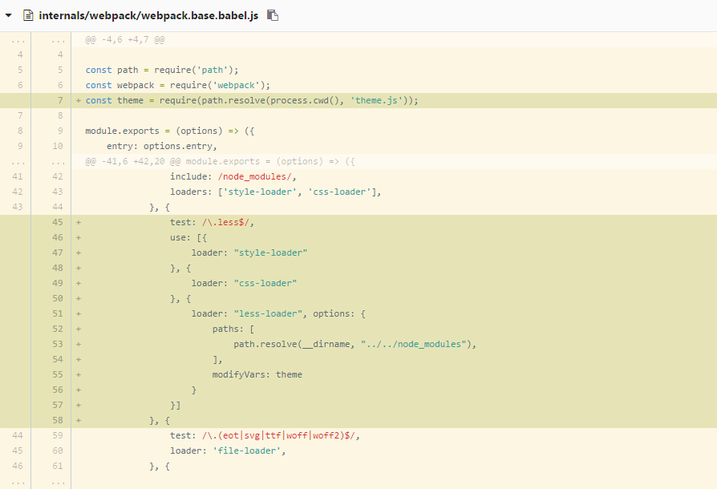
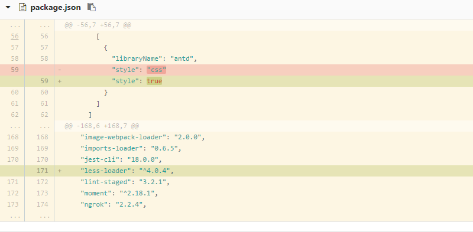
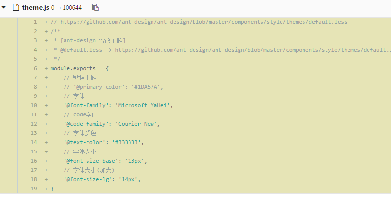

# 修改` Ant-design `默认配置

### 官方给的解释
 
[定制主题 - 官方示例](https://ant.design/docs/react/customize-theme-cn)

尝试了好几次最终放弃,因为它给的例子写的很片面而且是配合使用官方的脚手架` antd-init ` 或 ` dva-cli `;

但是也介绍了` Ant-design `是怎么修改配置变量的;

> 我们使用 modifyVars 的方式来覆盖变量。 在具体工程实践中，有 package.theme 和 less 两种方案，选择一种即可。

 
### 手动开始自己配置

##### 第一步配置 ` Less `
 
` npm install -g less`

添加全局 ` Less ` 配置(如果有`less`直接到第二步)

 
##### 第二步在 ` package.json ` 中引入 `less-loader`
 
` npm install -save-dev less-loader`

 
##### 第三部修改 ` webpack ` 中的配置
 
目前所用的版本号: ` "webpack": "2.2.0-rc.3", `;

项目中并没有使用 ` Less ` 来写样式, 所有我们需要配置 ` .less `转换器;

新增配置如下:

### 默认变量
 
[default.less 默认](https://github.com/ant-design/ant-design/blob/master/components/style/themes/default.less)

### 使用
 
我们只需要了解 ` default.less `默认变量对应是什么就行了;

然后在 ` theme.js ` 中用对应的变量名重新赋值就可以替换默认的样式;

##### 每次修改了 ` theme.js ` 都需要重启服务 ` npm run dev `
