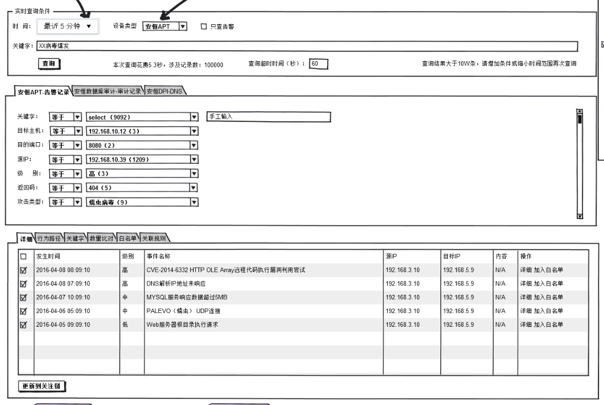
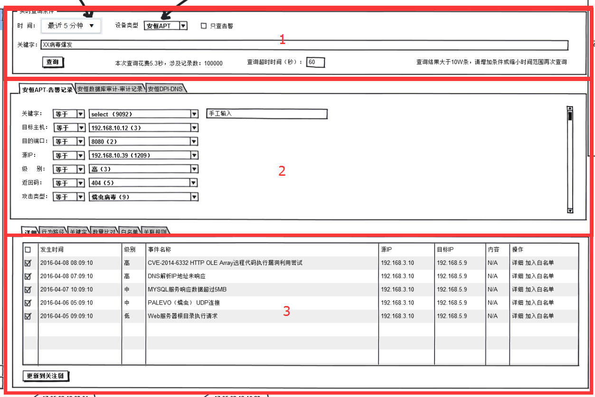
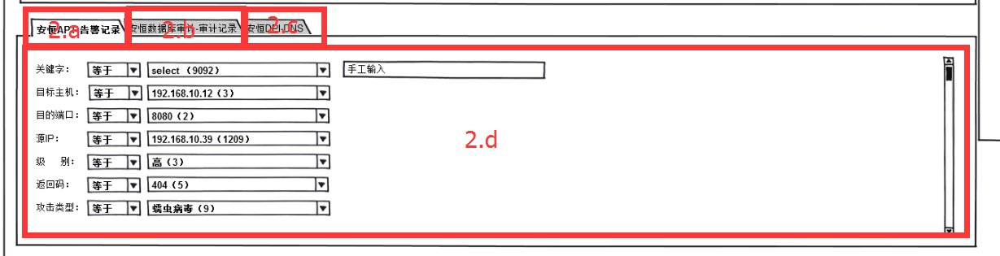
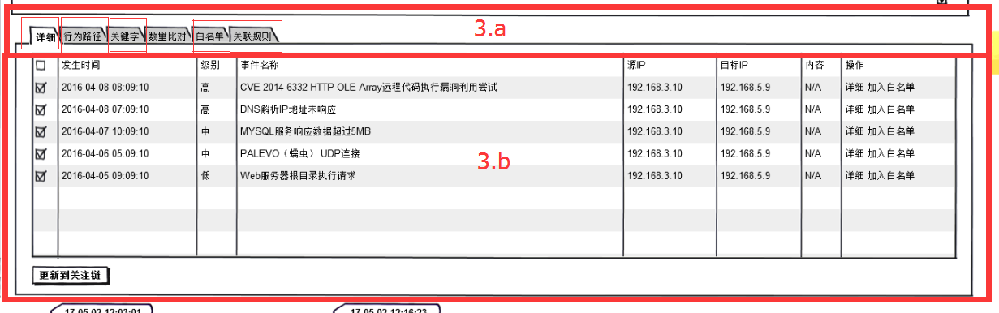

# 怎么构思界面中的数据结构

### 前言  
 
> 为什么要构思界面中的数据层?

对于现在前后端代码层分离而言,全都是JSON格式来对接数据,但是仅仅只是物理层面的分离;

JSON格式数据传递前端也面临着新的问题;

- 前端view层的构建
- view层和数据层的耦合度
- 怎么应对需求的变更  

 
### 前端view层的构建  
 
现在前端框架的盛行下,组件化理念被提及了很多.应用到项目就要考虑到
 
> 1、为什么要组件化,

> 2、为什么要把DOM界面拆分出很多组件来,

> 3、组件化在项目的什么阶段去做

1,2个为什么其实就是为了一个目的,就是界面的复用;写的好的组件可以在项目中多处应用;  
 
如果更通用型的可以单独抽离出来,在别的项目中引用;这些目的是为了能减少重复的劳动力,释放出更多的时间做更多的事情;  
 
第3个为什么,是和项目的积累、经验息息相关了;  
 
在没有很多的项目积累和经验的时候,在项目初期、以至于项目中期尽量不要去过多的考虑各种组件化;  
 
这样会大大提升项目的复杂度,自己不能掌控组件化碎片化的时候往往把项目的周期给延长了,这样会造成自己工作上的压力.这不是一个理想的状态.  
 
在一个项目开始,考虑的第一要素应该是怎么用最合理的方式去把项目尽快的完成,这样我们才有更多的时间对项目进行打磨,对于技术层面上提升也是一个循循渐进的方式.  
 

### view层和数据层的耦合度  
 
关于view层和数据层的耦合度,当然是越轻越好(数据的变更不影响view层大范围改动,view层的改动也不会对前端层面的逻辑层大范围的改动);  
 
无论是以后面对需求的迭代变更,还是项目后期进行组件化,耦合度越轻,能代码你所要做的事情也越轻松.(当然我也是经历了血的教训才能领悟到其中的滋味);  
 
#### 下面就直接拿例子来讲,怎么思考布局和解耦  
  

  
上面这个界面初步考虑会分为3大块(这里我们的界面全都在一个view层里,不考虑组件抽离)  
  

  
(下面所有的界面块会用图片中的红字做标识符)  
  
【块1】中没有没有很复杂的结构不用考虑再去细分了,就是FORM表单请求数据接口然后获得了【块2】中的数据;  
 
这里我们考虑【块2】怎么构建  
  

  
就目前已知的需求来讲,【2.d】界面中的DOM节点是一样的.那么我们这里只用写一个view就行了（DOM节点复用，数据来源一致,只是数据内容不一样）  
 
确认了【2.d】要怎么取实现,下面【2.a】【2.b】【2.c】就能很好的去构思了,我们只需要实现3个Tab栏点击切换实现` active `状态效果,在点击的时候通过  
不同的条件去反查数据展现相同节点不同数据的【2.d】;  
  

  
【块3】是这个界面的重中之重,我们初步划分为2块【3.a】【3.b】;  
 

由于【3.a】中的`Tab`栏对应【3.b】的结构是不明确的,我们暂时就定义每个` Tab `栏对应的【3.b】中的内容是不一样的.可以使用` Tab标签页 `,   
每点击一个` Tab `栏就切换【3.b】中的内容;  
 

对于数据层面的考虑,由于6个` Tab `栏的所要展现的内容也不一样,那么我们就要考虑用6个对象去存储6份数据,这样好处是【3.b】中的内容并不关心数据来源,它只关心内容的展现,  

6个` Tab `栏中存储6分数据,那么他们相互之间没有任何关联,其中任何一个` Tab `栏有需求变更,我们只需要改动其中的某一块就行了;
 

### 结语  
 
通过上的例子,我最终是想表达,对于界面结构做一个简单构思是很有必要的,任何一个模块的构建都不要和别的模块有太强的耦合,
 
这样至少可以在view层轻松的应对后期的维护、和版本的迭代,不然你会面对各种崎岖的需求,你自己写的代码以后会去折磨你自己;  
 

当然上述简单的讲解了下思路,只是提供一个方法,当然具体实施到项目中,我们也是需要更多的打磨才能找到更合理的方法.   
          
